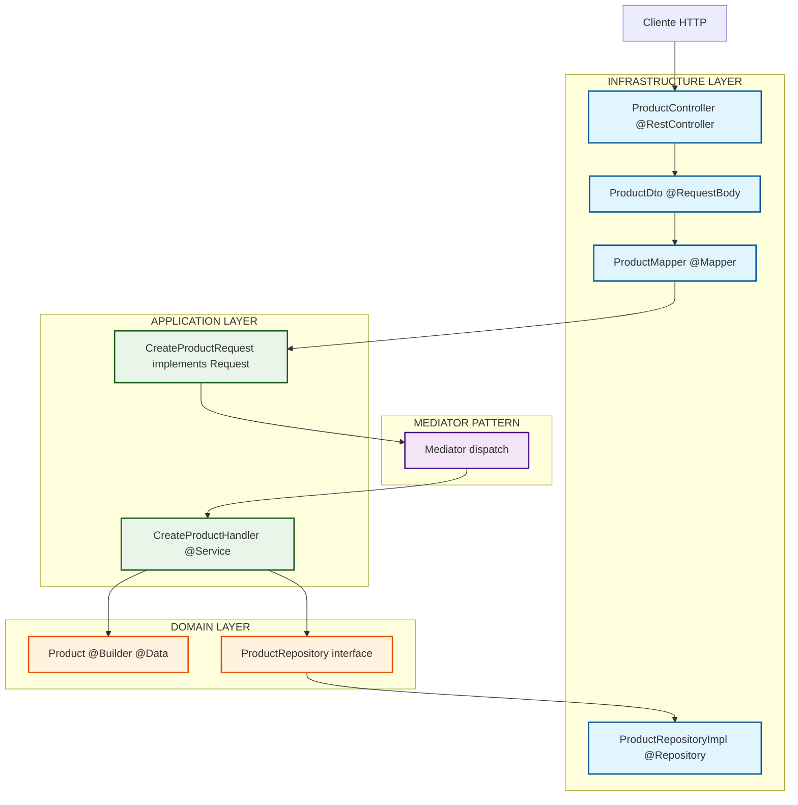

# Products API - Arquitectura Hexagonal con Mediator Pattern

## Introducción

Esta API implementa una arquitectura hexagonal (Ports & Adapters) combinada con el patrón Mediator. La decisión de usar esta arquitectura surge de la necesidad de mantener el código desacoplado y facilitar tanto el testing como el mantenimiento a largo plazo.

## Arquitectura del Sistema



## Flujo de una Request

### 1. Entrada HTTP

```http
POST /api/v1/products
Content-Type: application/json

{
  "id": 1,
  "name": "iPhone 15",
  "description": "Último modelo de Apple",
  "price": 999.99,
  "image": "iphone15.jpg"
}
```

### 2. Controller y Mapeo

```java
@PostMapping("")
public ResponseEntity<Void> saveProduct(@RequestBody ProductDto productDto) {
    CreateProductRequest request = productMapper.maptoCreateProductRequest(productDto);
    mediator.dispatch(request);
    return ResponseEntity.created(URI.create("/api/v1/products/" + productDto.getId())).build();
}
```

**Sobre los DTOs y @RequestBody**

Los DTOs nos permiten tener control total sobre la API sin exponer directamente nuestro modelo interno. Spring usa Jackson para convertir automáticamente el JSON entrante a un objeto Java cuando encuentra `@RequestBody`. Sin esta anotación, tendríamos que manejar manualmente la deserialización.

### 3. Mediator Pattern

```java
public <R, T extends Request<R>> R dispatch(T request) {
    RequestHandler<T, R> handler = (RequestHandler<T, R>) requestHandlerMap.get(request.getClass());
    
    if (handler == null) {
        throw new RuntimeException("No handler found for request type " + request.getClass());
    }
    
    return handler.handle(request);
}
```

El mediator actúa como un despachador central. En lugar de que los controllers conozcan directamente los handlers, el mediator se encarga de encontrar y ejecutar el handler apropiado. Esto hace que agregar nuevas funcionalidades sea más simple - solo necesitas crear el handler y automáticamente queda registrado.

### 4. Application Layer

```java
@Service
public class CreateProductHandler implements RequestHandler<CreateProductRequest, Void> {
    
    @Override
    public Void handle(CreateProductRequest request) {
        Product product = Product.builder()
                .id(request.getId())
                .name(request.getName())
                .description(request.getDescription())
                .price(request.getPrice())
                .image(request.getImage())
                .build();
        
        productRepository.upsert(product);
        return null;
    }
}
```

Cada handler maneja un caso de uso específico. Esto hace que el código sea más fácil de testear y mantener, ya que cada operación está claramente separada.

### 5. Domain Layer

```java
@Builder
@Data
public class Product {
    private Long id;
    private String name;
    private String description;
    private Double price;
    private String image;
}
```

El dominio contiene las entidades de negocio sin dependencias externas. Puedes testear estas clases sin necesidad de Spring o cualquier framework.

## Por qué esta arquitectura

**Separación clara de responsabilidades**
- Infrastructure maneja todo lo relacionado con frameworks y tecnologías externas
- Application coordina los casos de uso 
- Domain contiene la lógica de negocio pura

**Facilita el testing**
El dominio se puede testear de forma aislada, y cada handler puede testearse independientemente. Los tests de integración se enfocan únicamente en verificar que las capas se comunican correctamente.

**Independencia de frameworks**
Si mañana quisiéramos cambiar Spring por otro framework, solo tendríamos que modificar la capa de infrastructure. El dominio y la aplicación permanecerían intactos.

## Sobre los Mappers

```java
@Mapper(componentModel = "spring")
public interface ProductMapper {
    CreateProductRequest maptoCreateProductRequest(ProductDto productDto);
}
```

MapStruct genera automáticamente el código de mapeo en tiempo de compilación. Es más rápido que usar reflection y más seguro que el mapeo manual. El `componentModel = "spring"` hace que el mapper sea un componente de Spring, permitiendo la inyección automática.

## Estructura del proyecto

```
src/main/java/com/javier/productsapi/
├── common/                          # Código compartido entre módulos
│   └── mediator/                    # Implementación del patrón Mediator
├── product/                         # Módulo de productos
│   ├── application/                 # Casos de uso (Handlers)
│   ├── domain/                      # Entidades y contratos
│   └── infrastructure/             # Adaptadores externos
│       ├── api/                    # Controllers y DTOs
│       └── database/               # Implementación de repositorios
```

## Comentarios en el código

Para un proyecto real, recomiendo usar JavaDoc en métodos públicos y APIs, especialmente cuando la lógica no es obvia:

```java
/**
 * Procesa la creación de un nuevo producto en el sistema.
 * 
 * @param request datos del producto a crear
 * @return void - operación sin retorno de datos
 */
public Void handle(CreateProductRequest request) {
    // Implementación...
}
```

Los comentarios inline deberían explicar el "por qué", no el "qué".

## Extendiendo la aplicación

Agregar una nueva funcionalidad es directo. Por ejemplo, para eliminar productos:

1. Crear `DeleteProductRequest implements Request<Void>`
2. Crear `DeleteProductHandler implements RequestHandler<DeleteProductRequest, Void>`
3. Agregar endpoint en el controller

El mediator detecta automáticamente el nuevo handler sin configuración adicional.

## Conceptos clave

- **DTO**: Objeto que representa datos que viajan por la red
- **Entity**: Objeto del dominio que representa conceptos de negocio
- **Request**: Representa una intención o comando a ejecutar
- **Handler**: Procesa una request específica
- **Mediator**: Despachador que encuentra el handler correcto para cada request

La complejidad inicial de esta arquitectura se compensa con la facilidad de mantenimiento y testing que proporciona a medida que el proyecto crece.
