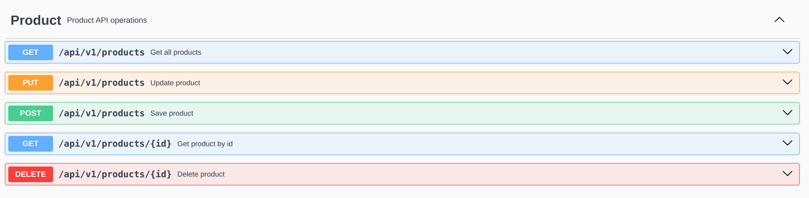

# Products API

Esta es una API REST para la gestión de productos que he desarrollado mientras aprendo Spring Boot. Es un proyecto personal donde he intentado aplicar las mejores prácticas que he ido aprendiendo en mi proceso de formación.

## Lo que he implementado

### Seguridad y Autenticación
He añadido un sistema completo de seguridad porque creo que es fundamental en cualquier aplicación real:

- **JWT (JSON Web Tokens)**: Para autenticar a los usuarios de forma segura
- **OAuth2 con GitHub**: Los usuarios pueden registrarse usando su cuenta de GitHub
- **Roles de usuario**: Sistema de USER y ADMIN para controlar permisos
- **Filtros de seguridad**: Verificación automática de tokens en cada petición
- **Renovación de tokens**: Los tokens se renuevan automáticamente antes de expirar

### Gestión de Productos
La funcionalidad principal incluye:

- **CRUD completo**: Crear, leer, actualizar y eliminar productos
- **Búsqueda y filtros**: Buscar por nombre, descripción, precio mínimo/máximo
- **Paginación**: Para manejar grandes cantidades de productos
- **Categorías**: Sistema de categorías para organizar productos
- **Reviews**: Los usuarios pueden dejar reseñas y puntuaciones
- **Imágenes**: Subida de imágenes para los productos
- **Detalles extendidos**: Información adicional de productos

### Gestión de Usuarios
- **Registro**: Los usuarios pueden crear cuentas nuevas
- **Login**: Autenticación con email y contraseña
- **Perfiles**: Información básica de usuario (nombre, apellido, email)
- **Roles**: Diferentes niveles de acceso según el rol

## Tecnologías que he usado

- **Java 21**: La versión más reciente del lenguaje
- **Spring Boot 3.5.4**: Framework principal
- **Spring Security**: Para toda la parte de seguridad
- **PostgreSQL**: Base de datos para desarrollo y producción
- **H2**: Base de datos en memoria para tests
- **JWT**: Para tokens de autenticación
- **OAuth2**: Para login con GitHub
- **Docker**: Para containerizar la aplicación
- **Maven**: Para gestión de dependencias
- **Swagger/OpenAPI**: Para documentar la API

## Arquitectura

He intentado seguir una arquitectura limpia separando responsabilidades:

```
src/main/java/com/javier/productsapi/
├── product/           # Todo lo relacionado con productos
│   ├── application/   # Casos de uso (comandos y consultas)
│   ├── domain/        # Lógica de negocio
│   └── infrastructure/# Capa de infraestructura
├── user/              # Gestión de usuarios
├── category/          # Sistema de categorías
├── review/            # Sistema de reseñas
└── common/            # Utilidades compartidas
```

## Cómo ejecutar el proyecto

### Con Docker (la forma más fácil)
```bash
docker-compose up -d
```

### En local
```bash
# Necesitas tener PostgreSQL corriendo
mvn spring-boot:run -Dspring-boot.run.profiles=dev
```

## Endpoints principales

### Autenticación
- `POST /api/v1/users/register` - Registrar nuevo usuario
- `POST /api/v1/users/login` - Iniciar sesión

### Productos (requieren autenticación)
- `GET /api/v1/products` - Listar productos con filtros y paginación
- `GET /api/v1/products/{id}` - Obtener producto específico (solo ADMIN)
- `POST /api/v1/products` - Crear nuevo producto
- `PUT /api/v1/products` - Actualizar producto
- `DELETE /api/v1/products/{id}` - Eliminar producto

## Configuración necesaria

Para que funcione completamente necesitas configurar estas variables de entorno:

```bash
# Para JWT
SECRET=tu_clave_secreta_para_jwt

# Para OAuth2 con GitHub
GITHUB_CLIENT_ID=tu_github_client_id
GITHUB_CLIENT_SECRET=tu_github_client_secret
```

## Testing

He implementado diferentes tipos de tests:

```bash
# Tests unitarios
mvn test

# Tests de integración
mvn verify -P it
```

## Documentación

Una vez que la aplicación está ejecutándose, puedes ver toda la documentación en:
- **Swagger UI**: http://localhost:8080/swagger-ui.html

## Lo que he aprendido

Este proyecto me ha servido para aprender muchos conceptos importantes:

- Cómo implementar seguridad en una API REST
- El patrón JWT para autenticación
- Integración con OAuth2
- Arquitectura hexagonal y CQRS
- Testing automatizado
- Docker y containerización
- Documentación de APIs con OpenAPI

---

Este proyecto refleja mi evolución como desarrollador y mi compromiso por aprender y aplicar buenas prácticas en cada proyecto que hago.



